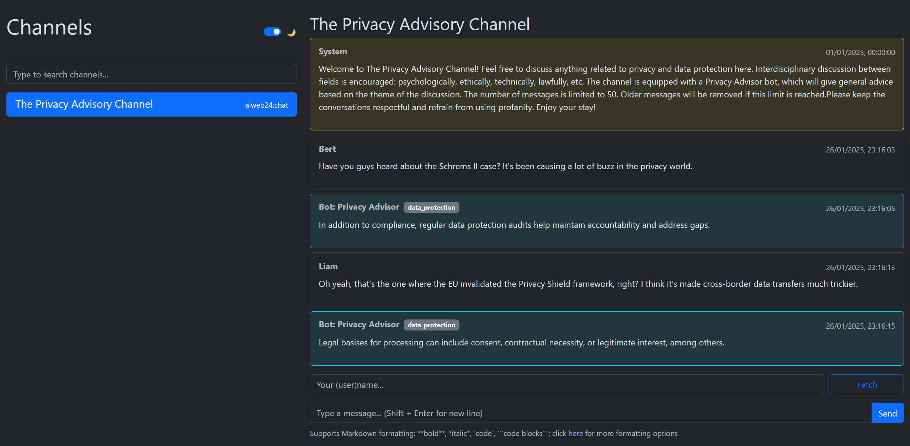

# Chat and React

A modern distributed chat system implementing a hub-and-spoke architecture, where multiple specialized chat channels can connect to a central hub. It also boasts a front-end web interface built on React and TypeScript. The system currently has one channel, which is a privacy discussion channel with an AI-powered Privacy Advisor bot, demonstrating how specialized channels can provide unique functionalities in a distributed environment.

## Overview

This modular system demonstrates a scalable approach to distributed chat systems with three core components:

- **Hub Server**: Acts as a central registry where chat channels can register themselves to enable dynamic discovery of available channels. The hub is built with Flask and SQLAlchemy and allows it to maintain channel metadata and handle cross-channel authentication.

- **Privacy Advisory Channel**: An example specialized channel that demonstrates the system's extensibility. It includes an AI-powered Privacy Advisor bot that monitors conversations and provides contextual privacy guidance. Additional specialized channels can be created following the same pattern. The bot monitors conversations and provides relevant privacy advice based on detected keywords in areas like:

  - Data protection regulations
  - Privacy concepts and principles
  - Security risks and threats
  - Privacy best practices
  - Privacy-enhancing tools

- **React Client**: A modern TypeScript/React front-end that provides a unified interface to interact with all available channels. It supports real-time messaging, markdown formatting, theme customization, and channel-specific features while maintaining a consistent user experience across different channel types.
  

## Background

I developed this system as part of a course in my Master's program in Cognitive Science. This course focuses on the application of AI technologies within web applications.

## Features

### Back-end

**Hub**

- Distributed chat system architecture
- Message history management
- Cross-channel authorization
- Health monitoring for channels

**Channel**

- Privacy-focused chat channel
- Total number of messages limiter
- Context-aware privacy advisor bot
- Profanity filtering
- Welcome message

### Front-end

- Modern React with TypeScript implementation
- Real-time message updates
- Markdown message formatting
- Dark/Light theme support
- Channel search functionality
- Responsive Bootstrap design
- Special styling for bot and system messages
- Multi-line message support with Shift+Enter
- Session-persistant username field

## Technical Details

### Back-end

- Built with Flask and SQLAlchemy
- SQLite database for channel registry
- JSON-based message storage
- RESTful API communication
- Environment-based configuration

### Front-end

- React 18 with TypeScript
- Bootstrap 5 for styling
- react-markdown for message formatting
- Context API for theme management
- Vite for development and building

## Project Structure

```
├── /                       # Root: Python back-end services
│   ├── channel.py          # Privacy Advisory Channel implementation
│   ├── hub.py              # Central channel registry server
│   ├── data/               # Channel data and bot knowledge
│   │   ├── messages.json   # Channel message history
│   │   ├── responses.json  # Bot response templates
│   │   └── triggers.json   # Bot trigger keywords
│   └── requirements.txt    # Python dependencies
│
├── react-client/           # React front-end application
│   ├── src/
│   │   ├── components/     # React components
│   │   ├── contexts/       # React contexts
│   │   ├── services/       # API services
│   │   ├── types/          # TypeScript types
│   │   └── App.tsx         # Main application component
│   └── package.json        # Node.js dependencies
```

## Getting Started

### 1. Back-end Setup

**1.1 Install Python dependencies**

```sh
pip install -r requirements.txt
```

**1.2 Set up environment variables**

Create a file called `.env` in the root directory of the project and enter the appropiate keys for the components.

- The `HUB_AUTHKEY` is `1234567890` by default, but could be changed in [hub.py](hub.py).
- The other keys can be randomly generated and up to 32 characters.

```sh
HUB_AUTHKEY="1234567890"
CHANNEL_AUTHKEY="your_channel_key"
FLASK_SECRET_KEY="your_secret_key"
```

**1.3 Start the services**

```sh
# Terminal 1: Start hub server
python hub.py

# Terminal 2: Register channel to hub and start server
flask --app channel.py register
python channel.py
```

### 2. Front-end Setup

**2.1 Install Node.js dependencies**

```sh
cd react-client
npm install
```

**2.2 Start development server**

```sh
npm run dev
```

**2.3 (Optional) build app**

For a production server, change `HUB_URL` and `HUB_AUTHKEY` in [API.tsx](react-client/src/services/API.tsx) to appropiate values, then build the app to be able to run it with [client.wsgi](client.wsgi).

```sh
npm run build
```

## Usage

1. Access the React client at `http://localhost:5173`
2. View and search available channels
3. Select a channel to join the conversation
4. Enter your username to start chatting
5. Use Markdown formatting in messages
6. Toggle between dark and light themes
7. The Privacy Advisor bot will automatically provide relevant advice

## License

This project is licensed under the Apache License 2.0 - see the [LICENSE](LICENSE) file for details.
